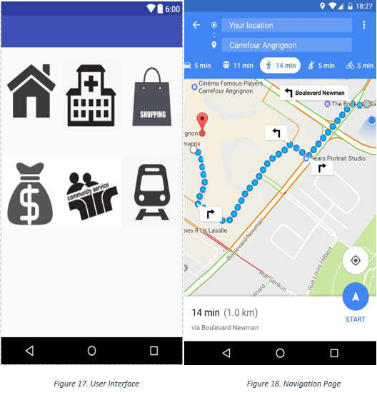
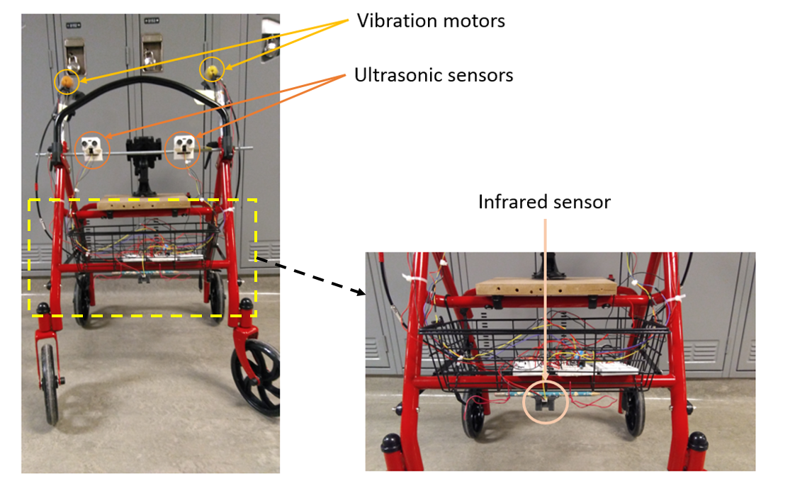
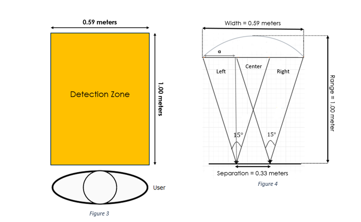
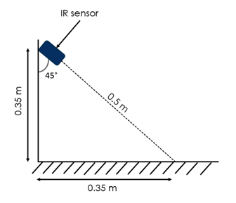
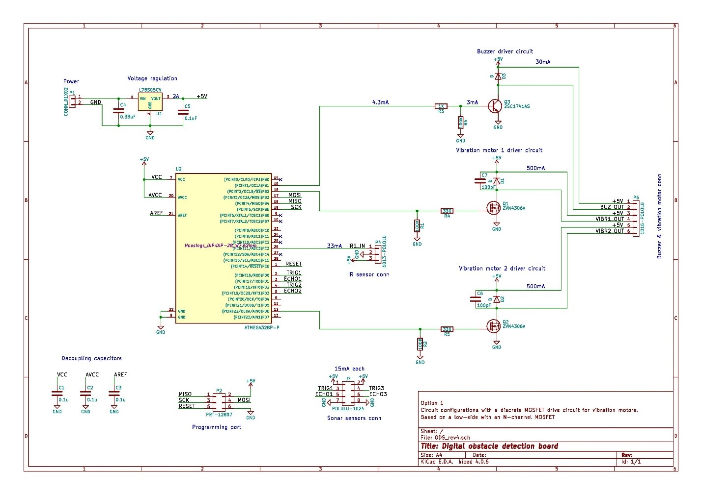

## The product is made up of 3 subsystems

1. Navigation System
2. Obstacle Detection System
3. Traffic Light Detection System

---

## Navigation System

---

## Obstacle Detection System

---

*Obstacle detection system specifications*

---

The IR sensor detects stairs, holes and sidewalk edges. The ouput of connected to a buzzer

---

*Obstacle detection functional diagram*

---

## Schematic

---

## Traffic Light Detection System

---

